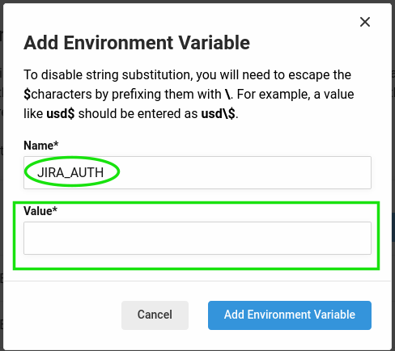

# AZ Orb [](https://circleci.com/gh/mobomo/az-orb) [](https://circleci.com/orbs/registry/orb/mobomo/az-orb) [](https://raw.githubusercontent.com/mobomo/az-orb/master/LICENSE)
Handles builds and deployments to Azure sites. Includes optional Jira integration (to transition tickets, 
create realeses, etc) and Slack notifications.

## Commands
The commands provided by this Orb uses the following APIs:
- Jira API with Basic Authentication
- Azure API

Since these APIs require an auth method, is a good practice to setup the auth/keys using Circle CI Env Variables, instead
of adding that "sensitive" data as plain text in your config file.

So, for the Jira basic auth, we use the `JIRA_AUTH` env var and for the Azure we use `AZURE_KEY_[ENV]`
(ie: `AZURE_KEY_DEV`, or `AZURE_KEY_TEST`). You have to setup these env vars using the circle CI UI, in order to use
this Orb.

See an example in the "jira-transition" command below.

### git-publisher
Pushes tag to project repository.

This command receives the following parameters:

- `git-username`: The automation git username to push the tag.
- `git-email`: The automation git user email to push the tag.
- `tag`: Tag to be deployed. It's default value is `build-v1.0.${CIRCLE_BUILD_NUM}`.

### jira-version
This command creates a "version" (release) in Jira using Jira API.

Receives the following parameters:
- `tag`: The tag name to use to create the version. It's default value is `build-v1.0.${CIRCLE_BUILD_NUM}`
- `project`: The Jira project to create the version.
- `description`: The Version description.
- `jira-url`: The Jira Cloud URL.

### blt-build
Builds the blt artifact (creates a tag and push it to AZURE repository).

This command receives a `tag` parameter which is used to se the tag name that will be created and pushed.
The default value for this tag is `build-v1.0.${CIRCLE_BUILD_NUM}`


TO-DO: Add a "segment" param to increment the tag following semantic versioning and be more flexible.

### blt-deploy
Deploys a tag to Azure env using its API.


This command receives the following parameters to performs the API calls:

- `tag`: The tag to deploy to az, the default value is `build-v1.0.${CIRCLE_BUILD_NUM}`
- `env`: The environment where to deploy. env could be either "dev", "test", "prod", the default value is "dev"
- `deploy-type`: The type of deployment, could be "code" for code only, or "code, db" for the Code and Database
  deployments.
- `az-user`: Sets the az user account.
- `az-site`: Sets the project site.

**NOTE**: To perform API calls to the azure is recommended to create a "machine" user in the azure
(in each environment!). This user should have the role "release engineer" to have the correct permissions to use the
`update` endpoint.

### jira-transition
Gets all tickets included between "current" deployed tag and "latest" tag, and transitions those tickets after a
successful deployment.

This command receives the following parameters:

- `tag`: The "latest" tag to be used by git log to list tickets that were included between current..latest
  The default value is `build-v1.0.${CIRCLE_BUILD_NUM}`
- `az-user`: The Azure username.
- `az-site`: The Azure site.
- `env`: The environment where to deploy. It's default value is "test"
- `jira-url`: The Jira Cloud URL
- `jira-transition-id`: The Jira transition ID

**NOTE:** To avoid setting the auth token in your config files, you must define it as an CircleCI Environment Variable.

Using the CircleCI UI, you can go to your Project > Project Settings > Environment Values > Add Environment Value called
`JIRA_AUTH`

In order to encode the username:password string, you can run:
```shell
echo -n 'jira_user_email:jira_api_token' | openssl base64
```

Copy the base64 encoded string and paste it in the Environment Variable `Value` field:



### TO-DO
1. Improve exit codes for commands, specially the ones using API calls.
2. Implement semantic versioning for tags in a more "flexible" way. Right now we are only incrementing "patch".
3. Improve Slack notifications messages.
4. Cleanup for "on hold" workflows? (not really related to this Orb)
